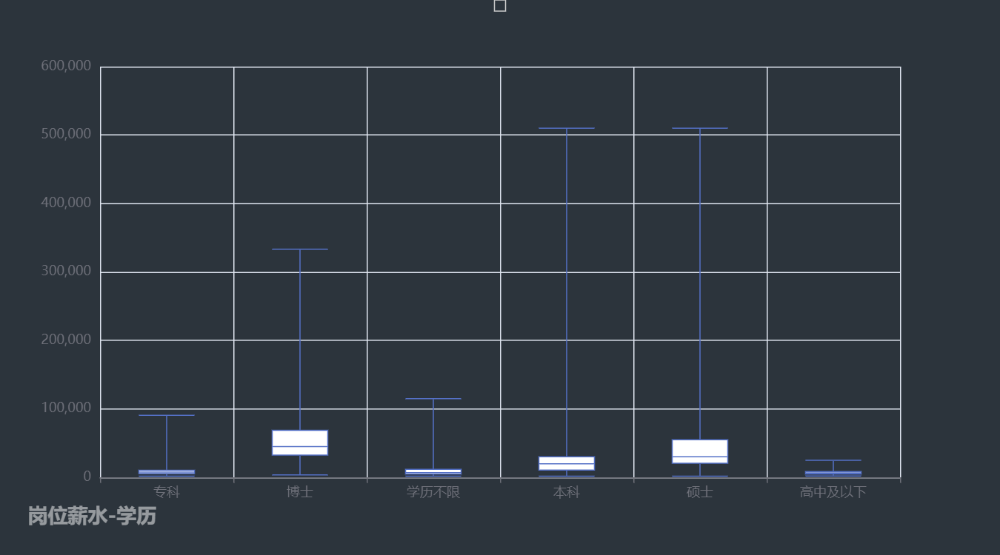

# Sherioc04_PythonAnalysis 
## 项目描述

项目：全国热门城市人工智能AI岗位数据分析与可视化

github地址： https://github.com/3051617781/Sherioc04_PythonAnalysis.git

介绍：通过爬取招聘网站（boss直聘https://www.zhipin.com/）热门城市AI岗位信息，对数据进行清洗，分析并可视化全国热门城市人工智能AI岗位的学历要求、工作经验、公司规模、技能要求、薪资之间的关系。

## 如何成功运行项目

1、安装第三方库对应版本

```python
requests	(2.31.0)
numpy   	(1.26.0)
pandas 		(2.1.0)
re			(2.2.1)
jupyter 	(1.0.0)
IPython		(8.17.2)
selenium 	(4.15.0)
jsonpath	(0.82.2)
lxml		(4.9.3)
pyechart 	(2.0.4)
```

2、运行爬虫（已有数据，不必再次爬取）

```python
1、打开project
2、运行spider文件夹下的spider_semi.py 或 spider_auto.py
3、爬取的数据保存在spider/data文件夹下

说明：由于全自动auto爬虫ip限制，故使用半自动爬虫semi并将结果已经放于analysis的data文件夹下，无需进行爬取
```

3、运行数据分析与可视化

```java
1、进入到analysis文件夹
2、打开jupyter notebook
3、运行analysis.ipynb
4、可视化html输出在html文件夹中，notebook同时内嵌显示
```


项目结构

```pthon
│  README.md
│
├─picture  								# README.md图片文件夹
│
├─analysis		# 数据分析
│  │  analysis.ipynb					
│  │
│  ├─.ipynb_checkpoints
│  │      analysis-checkpoint.ipynb
│  │
│  ├─data								# 已爬取好的csv数据文件夹
│  │  │  data.csv 						
│  │  │
│  │  └─.ipynb_checkpoints
│  │          data-checkpoint.csv
│  │
│  └─html 								# 生成的可视化html文件夹
│
└─spider 		# 爬虫
    │  chromedriver.exe
    │  spider_auto.py
    │  spider_semi.py
    │
    └─data								# 爬虫爬取结果文件夹
```


## 结果图片

- 爬取过程

  

- 饼图

  

  

  

- 箱线图

  

  

  

- 词云图

  

- 3d柱状图

  

- 地图

  

## 


